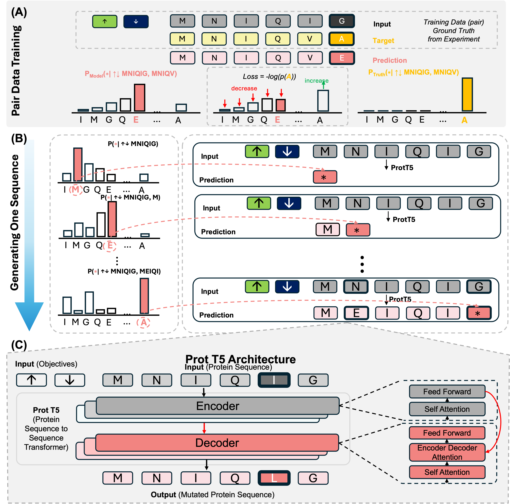

# Transcription factor-based biosensor development by machine learning-guided cell-free gene expression  

This repository contains code for the Multi-Objective Controlled Extrapolation method used in the paper *Transcription factor-based biosensor development by machine learning-guided cell-free gene expression* to design biosensors with higher response to Lead over Zinc.



This work introduces a **framework** for multi-objective protein design that leverages **pair-wise sequence information** to create novel sequences outside the training distribution. By extending previous extrapolation frameworks to multiple objectives, we provide an effective method for designing protein sequences optimized for selectivity.

## Highlights:
- **Multi-Objective Design:** Demonstrates two objectives for protein selectivity—Lead over Zinc. The framework can be easily adapted to any number of objectives.
- **Out-of-Distribution Extrapolation:** Based on iterative controlled extrapolation designed for out-of-distribution generalization.
- **Sequence-Based:** Does not require structural information and is easily adaptable to experimental deep mutational scanning or variant data for any objective.
- **Data Augmentation:** Paired data training increases the size and diversity of the training dataset.

## **Code Description**  
This code implements the **multi-objective controlled extrapolation** framework described in the paper. Below is an overview of the main modules and an example to run the code on a dataset with Lead and Zinc data, optimizing Lead response over Zinc.

Parts of this codebase were adapted from:

- https://github.com/vishakhpk/iter-extrapolation — iterative controlled extrapolation method implementation
- https://github.com/huggingface/transformers — model loading, fine-tuning, and tokenization

We thank the original authors for making their work openly available.


# Environment Setup

This project uses a Conda environment named `transformers`. Follow these steps to create and activate the environment:

## Create the environment

Make sure you have [Conda](https://docs.conda.io/en/latest/miniconda.html) installed.

Then run:

```bash
conda env create -f environment.yml
```

## Modules Under utils

### **Pair Data Generation Modules**  
- **`get_label()`**: Generates directional objectives for paired data.  
- **`get_pair_data()`**: Creates labeled pair data from input pairs.  
- **`balance_pair_data()`**: Filters pairs to keep significant ones (above experimental noise) and ensures coverage across objective categories.  
- **`create_one_input_pair()`**: Creates a single pair training text with source and target sequences.  
- **`generate_json_file()`**: Generates a JSON file from a list of pairs for training.  
- **`save_json()`**: Saves data to a JSON file.  
- **`load_json()`**: Loads data from a JSON file.  
- **`save_to_jsonl()`**: Saves data to a JSONL file.

### **Model Training Modules**  
- **`train_model_with_lora()`**: Trains the ProtT5 model using low-rank adaptation (LoRA) on paired training data JSON files.

### **Model Generation Modules**  
- **`load_model()`**: Loads a LoRA-trained model with tokenizer and weights.  
- **`get_tgt_seq()`**: Returns 20 sequences based on top-k sampling from a seed sequence.  
- **`get_mut_fromseq()`**: Converts a mutation notation (e.g., M1A) into a sequence.  
- **`get_seq_frommut()`**: Extracts mutation notation(s) from a sequence. Multi-mutations are separated by underscores (e.g., M1A_N20C).  
- **`generating_muts()`**: Generates novel mutations from seed sequences using the seq2seq model at a specified temperature.

## Data
- **`WT_seq.npy`**: Wild-type protein sequence (for PbrR).  
- **`input.csv`**: Contains columns: `Mutant`, `1uM Pb`, `30uM Zn`, and `seq`.  
  - `Mutant`: Variant mutation in AASiteSub format (e.g., M1A), multi-mutants separated by underscores (e.g., M1A_N20C).  
  - `1uM Pb`: Fold change response to Lead.  
  - `30uM Zn`: Fold change response to Zinc.  
  - `seq`: Full sequence of the variant.

## **Quick Start Guide**  
Below is an example workflow to use the multi-objective controlled extrapolation framework:
```python
# STEP 1: Generate Paired Data from Experimental Mutation Data
import torch
import itertools
import numpy as np
import pandas as pd

from utils.pair_data_generation_modules import get_label, get_pair_data, balance_pair_data
from utils.pair_data_generation_modules import create_one_input_pair, generate_json_file, save_json, load_json, save_to_jsonl

# Load Input CSV File Containing Variant, Fold Changes for Pb and Zn, and Variant Sequence
data = pd.read_csv('input.csv')
data.columns = ["Variant", "Pb", "Zn", "seq"]

# Generate All Possible Pairs 
pairs = list(itertools.combinations(data.itertuples(index=False), 2))

# Define Threshold For Pair Differences in Each Fold Change Metric (Pb and Zn)
PB_THRESHOLD = 0.5  
ZN_THRESHOLD = 0.5 

# Generate Pair Data
pair_data_df = get_pair_data(pairs, pb_thresh = PB_THRESHOLD, zn_thresh = ZN_THRESHOLD)

# Balance the Data so that we have similar number of pairs for each objective category 
# We also Check Coverage to Make sure we see all mutants at least once in the pair data
balanced_df = balance_pair_data(pair_data_df, data)

# We take a look At the Balanced Pairs:
balanced_df.head()

# Make the Pair Data into a List For Generating Input Text for Seq2Seq Model
balanced_list_pairs = {(row["Mutant1"], row["Mutant2"]) for _, row in balanced_df.iterrows()}

# Check The Number of Unique Balanced Pairs
print(f"Number of Unique Balanced Pairs: {len(balanced_list_pairs)}")

# Generate json file for seq2seq model input. This is our Training Data.
# The Length of this training data is two times the number of unique balanced pairs
# because for each unique pair we can reverse source and target 
training_data = generate_json_file(data, balanced_list_pairs)

# Give Dataset name for naming JSONL file
dataset_name = "PbrR"

# Save the list of dictionaries to JSONL file
save_to_jsonl("pair_data_"+dataset_name+".json", training_data)

# Print Length of Training Set 
print(f"Length of Training Set: {len(training_data)}")

# STEP 2: Model Training
from utils.model_training_modules import train_model_with_lora

# Select Device to Train Model On (GPU if available)
device = torch.device('cuda:0' if torch.cuda.is_available() else 'cpu')

# Load Model and Dataset
model_id = "Rostlab/prot_t5_xl_uniref50"
dataset_name = "PbrR"

# Train Model on Paired Data with LORA
train_model_with_lora(model_id, dataset_name, device)

# STEP 3: Generate Sequences with Model
from utils.model_generation_modules import load_model
from utils.model_generation_modules import get_tgt_seq, get_mut_fromseq, get_seq_frommut, generating_muts

# Define Device Used to Load Model (GPU if available)
device = torch.device('cuda:0' if torch.cuda.is_available() else 'cpu')
# Give Dataset Name and Foundation Model ID
dataset_name = "PbrR"
model_id = "Rostlab/prot_t5_xl_uniref50"

# Load the Trained Model
tokenizer, loaded_model = load_model(model_id, dataset_name, device)

# Get Seed Sequences (Better than WT)
data = pd.read_csv('input.csv')
data.columns = ["Variant", "Pb", "Zn", "seq"]
starting_points = data.query("Pb > 2.0").query("Zn < 0.5")

# Get the list of mutants (sorted) that has been seen already in experiments
sorted_mutant_list = ['_'.join(sorted(i.split('_'))) for i in data.Variant.tolist()]

# Generate New Mutations
generated_mutants = generating_muts(0, 1.0, starting_points, tokenizer, device, loaded_model, sorted_mutant_list)
```


